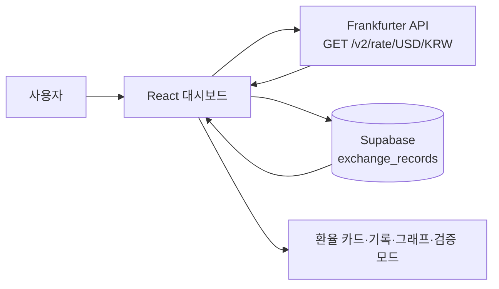

# USD/KRW 환율 정보판

Frankfurter API에서 USD/KRW 환율을 조회하고 Supabase에 날짜별 기록을 저장하는 React 대시보드입니다. 사용자는 현재 환율, 날짜별 추이, 이전 기록과의 변화량을 확인하고 그래프를 확대·이동할 수 있습니다.

## 프로젝트 개요

이 프로젝트는 다음 흐름을 하나의 화면에서 제공하는 것을 목표로 합니다.

- 외부 환율 API에서 최신 USD/KRW 데이터 조회
- `Asia/Seoul` 기준 오늘의 기록 저장 또는 갱신
- 저장된 환율의 기간별 추이와 최신 두 기록 비교
- API 장애 상황을 실제 장애 없이 모의실험하고 처리 결과 확인

## 주요 기능

| 기능 | 설명 | 구현 근거 |
| --- | --- | --- |
| 현재 환율 조회 | Frankfurter API에서 USD/KRW 환율과 API 기준 날짜를 조회합니다. | [`src/App.jsx`](src/App.jsx) |
| 오늘 기록 저장 | 한국 시간 기준 날짜를 키로 사용해 오늘 기록을 갱신하거나 새로 저장합니다. | [`src/App.jsx`](src/App.jsx) |
| 날짜별 기록 | Supabase에 저장된 기록을 최신 날짜순으로 보여줍니다. | [`src/App.jsx`](src/App.jsx) |
| 이전 기록 비교 | 최신 두 기록의 환율 차이와 변화율을 계산해 표시합니다. | [`src/App.jsx`](src/App.jsx) |
| 기간별 추이 | 3일, 5일, 1개월, 전체 범위로 그래프 데이터를 필터링합니다. | [`src/App.jsx`](src/App.jsx) |
| 그래프 조작 | 드래그 확대, 확대 후 Pan, 휠 확대·축소, 버튼 이동, 전체보기 초기화를 제공합니다. | `ReferenceArea` 및 차트 이벤트 핸들러 |
| 장애 검증 모드 | Timeout, 인증 실패, 호출 제한, 오프라인, 응답 형식 변경을 안전하게 모의실험합니다. | `simulateError()` |
| 오래된 데이터 처리 | 조회 실패 시 마지막 정상값을 유지하고 오래된 데이터 상태로 표시합니다. | `fetchRate()` 오류 처리 |
| 반응형 화면 | 좁은 화면에서 카드, 기간 선택, 차트 컨트롤을 재배치합니다. | [`src/App.css`](src/App.css) |

## 기술 스택

| 구분 | 기술 | 사용 목적 |
| --- | --- | --- |
| Frontend | React `19.2.8` | 대시보드 UI와 상태 관리 |
| Build | Vite `8.2.2` | 개발 서버와 운영 빌드 |
| Chart | Recharts `3.10.1` | 환율 추이 Area 차트와 Tooltip |
| Database | Supabase JS `2.112.3` | `exchange_records` 조회·저장·갱신 |
| External API | Frankfurter API | USD/KRW 환율 원자료 |
| Lint | oxlint `1.79.0` | 정적 코드 검사 |

## 동작 흐름



페이지가 열리면 저장 기록을 먼저 불러온 다음 최신 환율을 조회합니다. 정상 응답에는 현재값을 반영하고 오늘 날짜의 기록을 확인한 뒤 갱신 또는 신규 저장합니다. API 응답이 실패하거나 `rate`, `date` 필드 형식이 맞지 않으면 새 값을 저장하지 않고 오류 상태로 전환합니다.

## 주요 사용자 흐름

1. 페이지에 진입하면 Supabase 기록과 최신 API 데이터를 불러옵니다.
2. `새로고침` 버튼으로 최신 환율을 다시 조회할 수 있습니다.
3. `날짜별 기록`에서 저장된 이력을 확인하고, `이전 기록과 비교`에서 최신 두 기록의 차이를 확인합니다.
4. `환율 추이 그래프`에서 3일·5일·1개월·전체 기간을 선택합니다.
5. 그래프를 드래그하면 선택 영역을 확대할 수 있고, 확대 후 드래그하면 좌우로 이동할 수 있습니다. `＋`, `－`, 좌우 이동 버튼, 마우스 휠도 사용할 수 있습니다.
6. 장애 처리 흐름을 확인할 때는 `검증 모드`를 열고 테스트 유형을 선택합니다. 이 기능은 실제 외부 API에 장애를 발생시키지 않습니다.

## 과제 기능 점검 항목

현재 소스에서 확인되는 구현 여부를 정리한 표입니다. 실제 브라우저 조작을 다시 수행한 결과와는 구분해야 합니다.

| ID | 점검 항목 | 소스에서 확인한 구현 |
| --- | --- | --- |
| T05-01 | 그래프 기간 선택 | 3일·5일·1개월·전체 버튼 |
| T05-02 | 기간별 데이터 변경 | `period` 기준 `chartData` 필터 |
| T05-03 | 특정 데이터 확인 | 커스텀 Tooltip |
| T05-04 | 표시 범위 확인 | 데이터 최소·최대값 기반 Y축 패딩 |
| T05-05 | 기록과 그래프 비교 | `exchange_records`에서 동일한 환율값 사용 |
| T05-06 | 그래프 조작 기능 | 확대·축소·이동·초기화 컨트롤 |
| T05-07 | 날짜 구간 이동 | 확대 상태 Pan 및 좌우 이동 버튼 |
| T05-08 | 확대·축소 | 드래그 영역, 버튼, 휠 확대·축소 |
| T05-09 | 확대 상태 이동 | 확대 후 마우스 Drag/Pan |
| T05-10 | 좁은 화면 사용 | `App.css`의 반응형 미디어 쿼리 |

## 설치 및 실행

### 사전 요구사항

- Node.js `20.19.0 이상` 또는 `22.12.0 이상`
- npm
- Frankfurter API와 Supabase에 접근할 수 있는 네트워크
- Supabase 프로젝트와 `exchange_records` 테이블

Node.js 조건은 `package-lock.json`에 기록된 Vite·oxlint 패키지의 엔진 조건을 기준으로 작성했습니다.

### 의존성 설치

프로젝트 루트에서 실행합니다.

```bash
npm install
```

### 환경 변수 설정

프로젝트 루트에 `.env.local` 파일을 만들고 아래 변수를 입력합니다. 실제 키와 URL은 README에 기록하지 않습니다.

```env
VITE_SUPABASE_URL=<your-supabase-project-url>
VITE_SUPABASE_PUBLISHABLE_KEY=<your-supabase-publishable-key>
```

### 개발 서버 실행

```bash
npm run dev
```

실행 후 Vite가 출력하는 로컬 주소로 접속합니다.

### 운영 빌드 및 미리보기

```bash
npm run build
npm run preview
```

## 환경 변수

환경 변수는 [`src/supabase.js`](src/supabase.js)에서 `createClient()`를 초기화하는 데 사용됩니다.

| 변수명 | 필수 여부 | 용도 | 예시 |
| --- | --- | --- | --- |
| `VITE_SUPABASE_URL` | 필요 | Supabase 프로젝트 URL | `<your-supabase-project-url>` |
| `VITE_SUPABASE_PUBLISHABLE_KEY` | 필요 | 브라우저에서 사용하는 Supabase publishable key | `<your-supabase-publishable-key>` |

`.env`, `.env.local`은 `.gitignore`에 포함되어 있습니다. 브라우저에 노출되는 publishable key만 사용하며, 서버 전용 secret이나 실제 키를 README·소스·커밋에 넣지 않아야 합니다.

## API 명세

### Frankfurter API

| 항목 | 내용 |
| --- | --- |
| Method | `GET` |
| URL | `https://api.frankfurter.dev/v2/rate/USD/KRW` |
| 인증 | 애플리케이션 코드에서 별도 인증 헤더를 보내지 않음 |
| 사용 위치 | `fetchRate()` |
| 기대 응답 필드 | `rate` (`number`), `date` (`string`) |
| 오류 처리 | HTTP 비정상 응답 또는 필드 형식 오류 시 오류 상태로 전환 |

검증 모드의 오류는 실제 API 호출 결과가 아니라 `simulateError()`가 만드는 테스트 경로입니다.

## Supabase 데이터 구조

코드는 `exchange_records` 테이블에서 아래 필드를 사용합니다.

| 필드 | 사용 목적 |
| --- | --- |
| `id` | 기존 날짜 기록 갱신 대상 식별 |
| `record_date` | `Asia/Seoul` 기준 기록 날짜 및 중복 확인 기준 |
| `rate` | 조회한 환율 |
| `normalized_value` | 그래프·비교 화면에서 사용하는 환율값 |
| `unit` | `KRW per USD` 단위 |
| `api_date` | Frankfurter API 기준 날짜 |
| `checked_at` | 조회 시각 |
| `signal_id` | `usd-krw` 식별자 |
| `source_name` | `Frankfurter API` 출처명 |
| `source_url` | 원자료 URL |
| `source_time` | API 기준 날짜 기반 출처 시각 |
| `fetched_at` | 데이터 수집 시각 |
| `record_timezone` | `Asia/Seoul` 기준 시간대 |

코드는 `record_date`로 기존 행을 찾은 뒤 있으면 `update`, 없으면 `insert`를 수행합니다.

## 오류 처리

- API 조회 중 오류가 발생하면 상태를 `시간 초과`, `인증 실패`, `호출 제한`, `오프라인`, `응답 형식 변경` 또는 일반 조회 실패로 표시합니다.
- 이전 정상 환율이 있으면 그 값을 유지하고 `오래된 데이터`로 표시합니다. 정상값이 없으면 환율을 표시하지 않습니다.
- 검증 로그는 최근 로그 일부를 화면에 보여주며, `로그 지우기`로 초기화할 수 있습니다.

## npm 스크립트

| 명령 | 설명 |
| --- | --- |
| `npm run dev` | Vite 개발 서버 실행 |
| `npm run build` | 운영용 정적 파일 빌드 |
| `npm run preview` | 빌드 결과 미리보기 |
| `npm run lint` | oxlint 정적 검사 |

## 프로젝트 구조

```text
.
├─ public/
│  ├─ favicon.svg
│  └─ icons.svg
├─ src/
│  ├─ assets/
│  │  ├─ hero.png
│  │  ├─ react.svg
│  │  └─ vite.svg
│  ├─ App.jsx       # 화면, API·Supabase·차트·검증 로직
│  ├─ App.css       # 화면 컴포넌트 및 반응형 스타일
│  ├─ index.css     # 전역 스타일
│  ├─ main.jsx      # React 진입점
│  └─ supabase.js   # Supabase 클라이언트 초기화
├─ index.html
├─ package.json
├─ package-lock.json
├─ vite.config.js
├─ .oxlintrc.json
├─ .gitignore
└─ HANDOFF.md       # 기존 인수인계·과제 진행 문서
```
