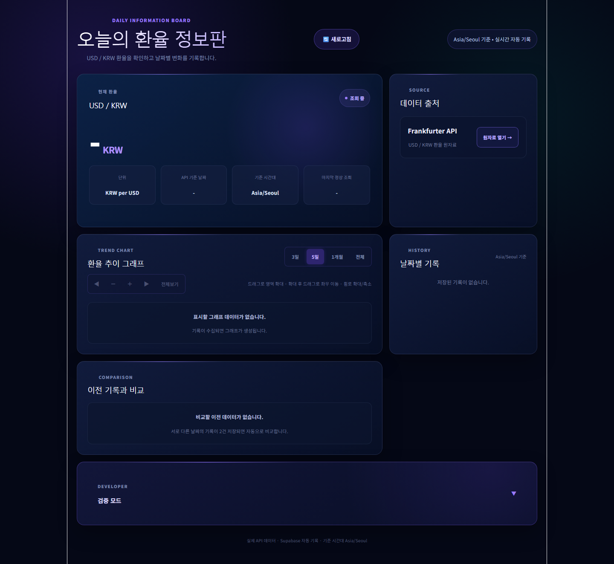
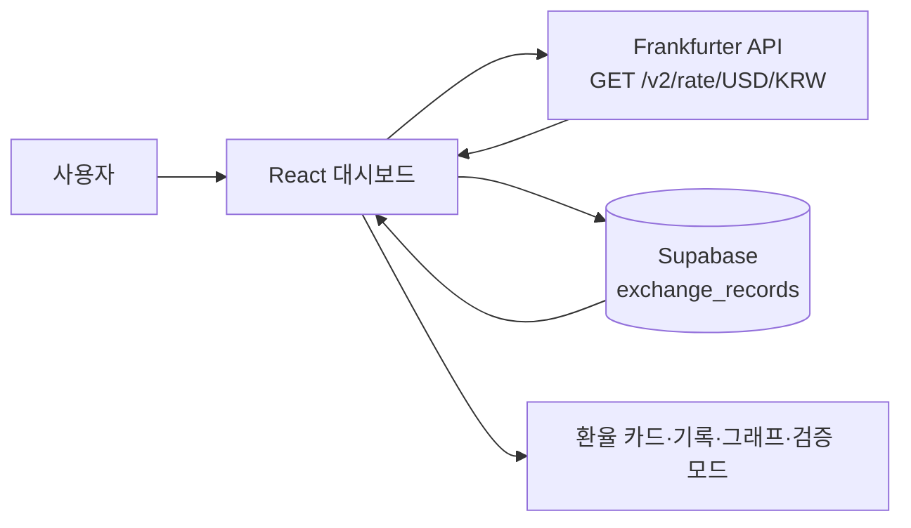
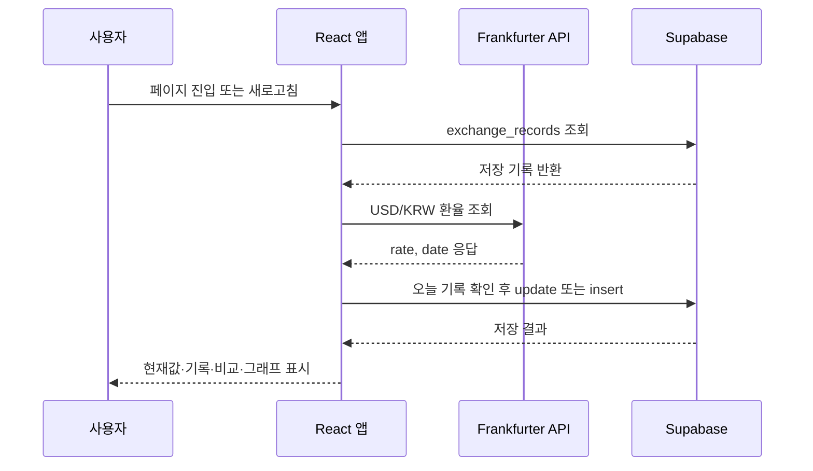
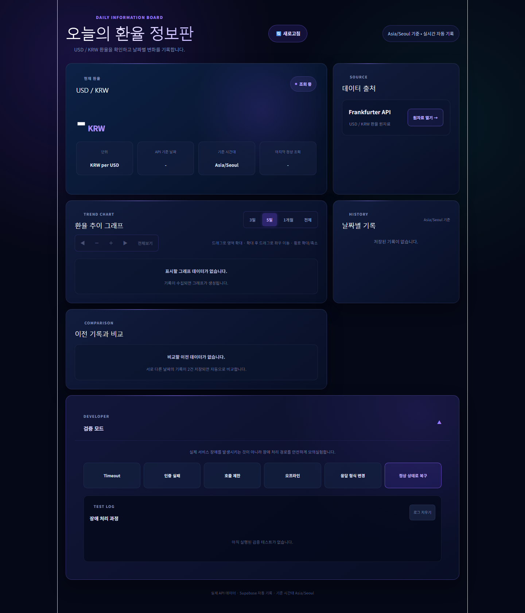
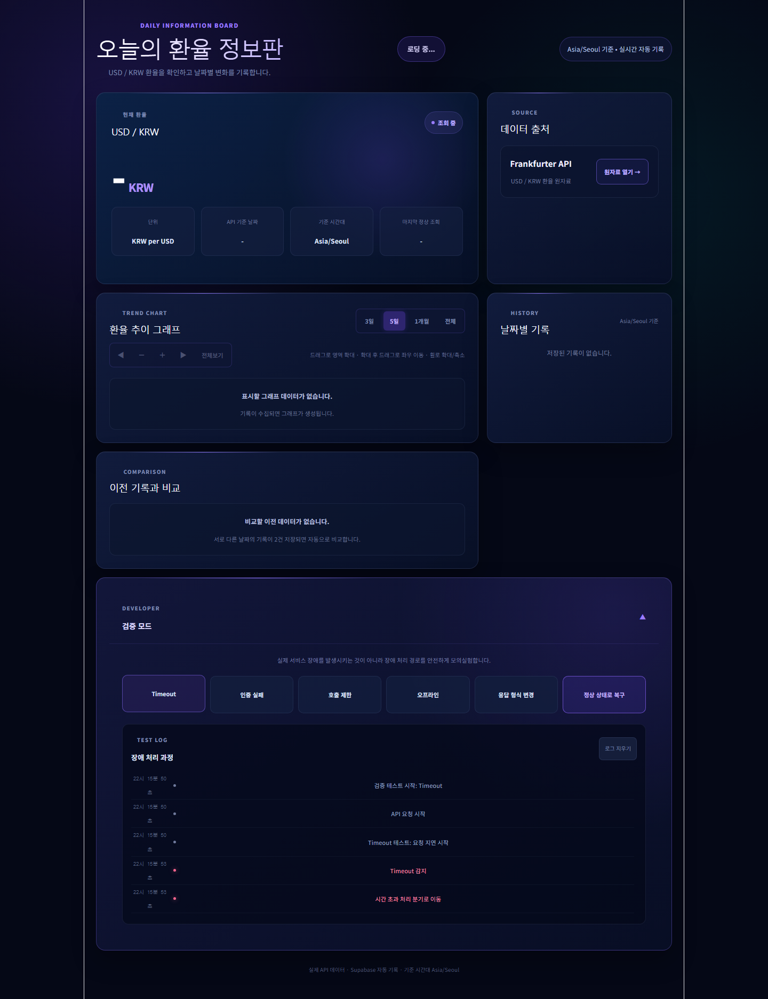

# USD/KRW 환율 정보판

> Frankfurter API의 USD/KRW 환율을 조회하고 Supabase에 날짜별로 기록해 추이와 이전 기록과의 변화를 보여주는 React 대시보드입니다.

<p align="center">
  
</p>

<p align="center">
  <a href="https://github.com/Gilin03/exchange-dashboard">GitHub Repository</a>
</p>

<p align="center">
  
  
  
  
</p>

## 목차

- [프로젝트 소개](#프로젝트-소개)
- [빠른 시작](#빠른-시작)
- [사용 방법](#사용-방법)
- [주요 기능](#주요-기능)
- [기술 스택](#기술-스택)
- [아키텍처](#아키텍처)
- [프로젝트 구조](#프로젝트-구조)
- [검증](#검증)
- [구현 포인트](#구현-포인트)
- [향후 개선](#향후-개선)

## 프로젝트 소개

이 프로젝트는 브라우저에서 USD/KRW 환율을 확인하고, 조회한 값을 날짜별 기록으로 관리할 수 있는 대시보드입니다. 최신 환율은 Frankfurter API에서 가져오며, Supabase의 `exchange_records` 테이블을 통해 기록·추이·비교 화면을 구성합니다.

### 프로젝트 목표

- 외부 API에서 최신 USD/KRW 환율과 API 기준 날짜를 조회합니다.
- 한국 표준시(`Asia/Seoul`) 기준으로 오늘 조회 기록을 저장하거나 갱신합니다.
- 저장된 기록을 기간별 그래프로 확인하고 최신 두 기록을 비교합니다.
- 실제 외부 API에 장애를 발생시키지 않고 오류 처리 경로를 모의실험합니다.

## 빠른 시작

### 요구 사항

- Node.js `20.19.0 이상` 또는 `22.12.0 이상`
- npm
- Frankfurter API와 Supabase에 접근할 수 있는 네트워크
- Supabase 프로젝트와 `exchange_records` 테이블

Node.js 버전 조건은 `package-lock.json`에 기록된 의존성의 엔진 조건을 기준으로 작성했습니다.

### 설치 및 실행

프로젝트 루트에서 의존성을 설치합니다.

```bash
npm ci
```

루트에 `.env.local` 파일을 만들고 Supabase 접속 정보를 입력합니다.

```env
VITE_SUPABASE_URL=<your-supabase-project-url>
VITE_SUPABASE_PUBLISHABLE_KEY=<your-supabase-publishable-key>
```

개발 서버를 실행합니다.

```bash
npm run dev
```

터미널에 표시된 Vite 로컬 주소로 접속합니다. 기본 포트는 `5173`입니다.

### 운영 빌드 및 미리보기

```bash
npm run build
npm run preview
```

환경 변수는 [`src/supabase.js`](src/supabase.js)에서 Supabase 클라이언트를 초기화할 때 사용합니다. 실제 키와 URL은 저장소나 README에 기록하지 않습니다.

## 사용 방법

1. 페이지에 진입하면 Supabase에 저장된 기록을 불러온 뒤 Frankfurter API에서 최신 환율을 조회합니다.
2. 정상 조회가 완료되면 현재 환율, API 기준 날짜, 마지막 정상 조회 시각을 확인합니다.
3. `새로고침` 버튼으로 최신 환율을 다시 조회할 수 있습니다.
4. `날짜별 기록`에서 저장된 이력을 확인하고, `이전 기록과 비교`에서 최신 두 기록의 차이와 변화율을 확인합니다.
5. `환율 추이 그래프`에서 `3일`, `5일`, `1개월`, `전체` 중 표시 범위를 선택합니다.
6. 그래프를 드래그해 영역을 확대하고, 확대된 그래프를 드래그해 좌우로 이동하거나 확대·축소 버튼과 마우스 휠을 사용할 수 있습니다.
7. 오류 처리 흐름을 확인하려면 `검증 모드`를 열고 테스트 유형을 선택합니다. 이 기능은 실제 외부 API 장애를 발생시키지 않습니다.

## 주요 기능

### 현재 환율 및 데이터 출처

- Frankfurter API의 `GET /v2/rate/USD/KRW` 응답에서 `rate`, `date` 필드를 읽습니다.
- 현재 환율을 `KRW per USD` 단위로 표시합니다.
- API 기준 날짜, `Asia/Seoul` 기준 시간대, 마지막 정상 조회 시각을 함께 표시합니다.
- 데이터 출처 카드에서 Frankfurter API 원자료 URL을 열 수 있습니다.

### 날짜별 기록 및 이전 기록 비교

- 정상 조회 후 `record_date`에 한국 시간 기준 오늘 날짜를 저장합니다.
- 오늘 날짜의 기존 기록이 있으면 갱신하고, 없으면 신규 기록을 저장합니다.
- 저장 기록은 최신 날짜순으로 불러옵니다.
- 서로 다른 날짜의 기록이 두 건 이상 있으면 최신 두 기록의 환율 차이와 변화율을 계산합니다.

### 기간별 환율 추이 그래프

- Supabase 기록을 `3일`, `5일`, `1개월`, `전체` 범위로 필터링합니다.
- Recharts `AreaChart`와 커스텀 Tooltip으로 날짜별 환율과 값을 확인합니다.
- 데이터 범위에 맞춰 Y축 영역에 여백을 적용합니다.
- 드래그 영역 확대, 확대 후 Pan, 마우스 휠 확대·축소, 좌우 이동, 전체보기 초기화를 지원합니다.

### 장애 처리 검증 모드

다음 오류 상황을 실제 외부 API에 요청하지 않고 화면에서 모의실험합니다.

- Timeout
- 인증 실패
- 호출 제한
- 오프라인
- 응답 형식 변경

각 테스트는 화면 상태와 로그를 갱신해 어떤 처리 분기로 이동했는지 확인할 수 있게 합니다.

### 오래된 데이터 처리와 반응형 화면

- API 조회에 실패하면 새 값을 저장하지 않습니다.
- 이전 정상값이 있으면 해당 값을 유지하면서 `오래된 데이터` 상태로 표시합니다.
- 이전 정상값이 없으면 환율 값을 표시하지 않는 경로로 처리합니다.
- `App.css`의 미디어 쿼리로 좁은 화면에서 카드와 그래프 컨트롤을 재배치합니다.

## 기술 스택

| 구분 | 기술 | 사용 목적 |
| --- | --- | --- |
| Frontend | React `^19.2.8`, React DOM `^19.2.8` | 대시보드 UI와 상태 관리 |
| Build | Vite `^8.2.2` | 개발 서버와 운영 빌드 |
| Chart | Recharts `^3.10.1` | 환율 추이 Area 차트와 Tooltip |
| Database | `@supabase/supabase-js` `^2.112.3` | `exchange_records` 조회·저장·갱신 |
| External API | Frankfurter API v2 | USD/KRW 환율 원자료 |
| Lint | oxlint `^1.79.0` | 정적 코드 검사 |

## 아키텍처

### 전체 구조



브라우저의 React 대시보드가 Frankfurter API에서 현재 환율을 조회하고, Supabase에서 날짜별 기록을 읽고 씁니다. API 응답과 저장 기록은 각각 현재 환율 카드, 기록 목록, 비교 영역, 추이 그래프에 반영됩니다.

### 주요 동작 흐름



조회 응답에 `rate`가 숫자가 아니거나 `date`가 문자열이 아니면 형식 오류로 처리합니다. 조회가 실패하면 새 데이터를 저장하지 않고, 기존 정상값이 있는 경우 그 값을 유지하면서 오래된 데이터 상태를 표시합니다.

## 프로젝트 구조

```text
.
├─ docs/
│  └─ assets/readme/
│     ├─ 01-overview.png       # 실제 시작 화면
│     ├─ 02-main-feature.png    # 실제 검증 모드 화면
│     └─ 03-result.png          # 실제 Timeout 처리 로그 화면
├─ public/
│  ├─ favicon.svg
│  └─ icons.svg
├─ src/
│  ├─ assets/                   # 이미지 및 기본 Vite 에셋
│  ├─ App.jsx                   # 화면, API·Supabase·차트·검증 로직
│  ├─ App.css                   # 컴포넌트 스타일 및 반응형 스타일
│  ├─ index.css                 # 전역 스타일
│  ├─ main.jsx                  # React 진입점
│  └─ supabase.js               # Supabase 클라이언트 초기화
├─ index.html
├─ package.json
├─ package-lock.json
├─ vite.config.js
├─ .oxlintrc.json
├─ .gitignore
└─ HANDOFF.md                   # 그래프 기능 인수인계 문서
```

## 검증

### 명령어 검증

| 구분 | 항목 | 명령 또는 확인 방법 | 결과 |
| --- | --- | --- | --- |
| 자동 | 의존성 설치 | `npm ci` | 통과 |
| 자동 | 린트 | `npm run lint` | 통과, 경고 2건 |
| 자동 | 운영 빌드 | `npm run build` | 통과, 번들 크기 경고 1건 |
| 자동 | 테스트 | `package.json` scripts 확인 | `test` script 없음 |

`npm run lint`의 경고는 `src/App.jsx`의 기존 React Hook 관련 경고이며 린터 종료 코드는 0입니다. `npm run build`는 완료되었고, 일부 번들이 500 kB를 초과한다는 Vite 경고가 출력되었습니다.

### 수동 확인 시나리오

| 시나리오 | 확인 결과 | 캡처 |
| --- | --- | --- |
| 시작 화면 접속 | 현재 환율 카드, 출처, 그래프, 기록, 비교, 검증 모드 영역 확인 | [01-overview.png](docs/assets/readme/01-overview.png) |
| 검증 모드 열기 | 장애 테스트 버튼과 안내 문구 확인 | [02-main-feature.png](docs/assets/readme/02-main-feature.png) |
| Timeout 실행 | `Timeout 감지`, `시간 초과 처리 분기로 이동` 로그 확인 | [03-result.png](docs/assets/readme/03-result.png) |

로컬 실행 당시 Supabase 환경변수에는 placeholder 값을 사용했습니다. 따라서 캡처에서 Supabase 저장 기록과 그래프 데이터가 비어 있는 상태는 확인했지만, Supabase 연결 성공이나 실제 데이터 저장 성공까지 검증한 결과는 아닙니다. Frankfurter API 조회와 검증 모드 화면은 실제 브라우저 실행으로 확인했습니다.

<details>
  <summary>추가 검증 화면 보기</summary>

  <p align="center">
    
    
  </p>
</details>

## 구현 포인트

### API 응답 검증과 오류 처리

- `fetchRate()`에서 HTTP 응답과 JSON 필드를 확인합니다.
- `rate`와 `date` 형식이 기대값과 다르면 `FORMAT_CHANGED` 경로로 처리합니다.
- Timeout, 인증 실패, 호출 제한, 오프라인은 `simulateError()`에서 별도 테스트 경로로 모의실험합니다.
- 실패 시 마지막 정상값 유지 여부에 따라 오래된 데이터 표시 또는 값 숨김을 선택합니다.

### 날짜 기준 저장과 데이터 흐름

- `getKoreaDate()`로 `Asia/Seoul` 기준 기록 날짜를 계산합니다.
- 오늘 날짜의 기존 행을 조회한 뒤 있으면 `update`, 없으면 `insert`를 수행합니다.
- 저장이 완료되면 기록을 다시 불러와 기록 목록·비교·그래프가 같은 데이터를 사용하도록 합니다.

### 그래프 Zoom/Pan 구현

- Recharts `ReferenceArea`로 사용자가 드래그한 구간을 선택합니다.
- 확대 상태를 인덱스 범위로 관리하고, 확대 후 마우스 드래그와 좌우 버튼으로 표시 구간을 이동합니다.
- 확대·축소 버튼, 마우스 휠, 전체보기 초기화를 함께 제공합니다.
- 기간 필터가 변경되면 확대·이동 상태를 초기화합니다.

## 향후 개선

- 현재 `package.json`에 테스트 스크립트가 없으므로 API 응답 검증, 오류 모의실험, 그래프 데이터 변환에 대한 자동 테스트를 추가할 수 있습니다.
- Supabase 테이블 생성과 RLS 정책을 재현할 수 있는 migration 및 환경별 설정 문서를 추가할 수 있습니다.
- Vite 빌드에서 확인된 큰 번들 경고를 기준으로 번들 분할과 로딩 전략을 검토할 수 있습니다.
